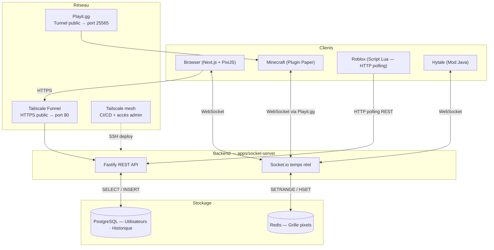

<div align="center">

# VoxelPlace

**Canvas collaboratif en temps réel — inspiré de r/place**

*Projet de fin d'année — Holberton School · Validation RNCP 6 (CDA)*

[](https://github.com/MaKSiiMe/VoxelPlace/actions/workflows/deploy.yml)
[](#tests)
[](LICENSE)

[](https://nodejs.org)
[](https://nextjs.org)
[](https://fastify.dev)
[](https://socket.io)
[](https://redis.io)
[](https://postgresql.org)
[](https://docker.com)
[](https://turborepo.dev)

**Site public :** [https://s56c-srv.tailedae07.ts.net](https://s56c-srv.tailedae07.ts.net)

</div>

---

## Vision du projet

r/place a démontré en 2017 et 2022 qu'une contrainte simple — *un pixel par personne, par période* — suffit à générer une dynamique sociale fascinante. VoxelPlace reproduit ce mécanisme en y ajoutant une dimension cross-platform : **navigateur web, Minecraft, Roblox, Hytale**.

Un joueur Minecraft pose un bloc coloré. Ce pixel apparaît instantanément dans le navigateur d'un utilisateur web, dans un monde Roblox et dans Hytale. La toile est le langage commun entre ces univers.

---

## Architecture système



### Réseau

| Service | Usage |
|---------|-------|
| **Tailscale Funnel** | Expose le frontend (port 80) en HTTPS public sans IP fixe ni ouverture de port |
| **Playit.gg** | Expose le serveur Minecraft (port 25565) publiquement — même principe |
| **Tailscale mesh** | Réseau privé entre la machine de dev et le serveur — CI/CD SSH, accès admin |

> Le serveur est dans un sous-réseau isolé pour des raisons de sécurité. Tailscale et Playit.gg permettent l'exposition publique sans compromettre cette isolation.

---

## Stack technique

| Couche | Technologie | Justification |
|--------|-------------|---------------|
| Monorepo | **Turborepo 2** | Build orchestré, cache partagé |
| Runtime | **Node.js 20** | ESM natif, performances I/O async |
| Framework HTTP | **Fastify 5** | 2× plus rapide qu'Express |
| Temps réel | **Socket.io 4** | WebSocket avec fallback, rooms |
| Grille pixels | **Redis 7** | Lecture O(1), buffer binaire |
| BDD | **PostgreSQL 16** | ACID, requêtes préparées, Merise |
| Auth | **bcryptjs + JWT** | Hachage 10 rounds, tokens 7 jours |
| Frontend | **Next.js 16 App Router** | SSR/CSR hybride, Turbopack |
| Rendu canvas | **PixiJS v8** | GPU-accelerated, texture dynamique |
| État UI | **Zustand** | Store léger, subscriptions sélectives |
| Styles | **Tailwind CSS 4** | Thème Tokyo Night |

---

## Stratégie Redis

Le canvas est un **buffer binaire** de 4 194 304 octets (2048 × 2048 × 1 octet).

```
Type Redis : String (binaire)
Clé        : voxelplace:grid
Taille     : 4 194 304 octets
Index      : y * 2048 + x
Valeur     : colorId (0–15), 1 octet par pixel
```

- **Lecture complète** : `GET voxelplace:grid` → O(1) — un seul appel Redis
- **Écriture atomique** : `SETRANGE voxelplace:grid <index> <Buffer[colorId]>` → O(1)
- **Métadonnées** : `HSET voxelplace:pixels "x,y" '{"username","colorId","source","updatedAt"}'`

---

## Palette de couleurs

16 couleurs canoniques, synchronisées entre le serveur, le frontend et le plugin Minecraft.
Source de vérité : `apps/socket-server/src/shared/palette.js`

| ID | Nom | Hex |
|----|-----|-----|
| 0 | Blanc | `#FFFFFF` |
| 1 | Gris clair | `#AAAAAA` |
| 2 | Gris | `#888888` |
| 3 | Noir | `#000000` |
| 4 | Marron | `#884422` |
| 5 | Rouge | `#FF4444` |
| 6 | Orange | `#FF8800` |
| 7 | Jaune | `#FFFF00` |
| 8 | Vert clair | `#88CC22` |
| 9 | Vert | `#00AA00` |
| 10 | Cyan | `#00AAAA` |
| 11 | Bleu clair | `#44AAFF` |
| 12 | Bleu | `#4444FF` |
| 13 | Violet | `#AA00AA` |
| 14 | Magenta | `#FF44FF` |
| 15 | Rose | `#FF88AA` |

Les couleurs sont débloquées progressivement via le **skill tree** (voir ci-dessous).

---

## Fonctionnalités

### Canvas
- Grille 2048×2048 pixels, rendu GPU via PixiJS v8
- Zoom centré curseur, pan, placement optimiste
- Cooldown 1 min (réduit par le streak jusqu'à 20s)
- Historique complet de chaque pixel (git blame)
- Sélection de zone rectangulaire + partage de lien
- Recherche joueur (surbrillance de ses pixels)
- Notifications temps réel (pixel écrasé)
- Timelapse + export GIF (global et personnel)
- Heatmap des zones actives

### Authentification
- Register / Login avec bcrypt 10 rounds + JWT 7 jours
- Droit à l'effacement RGPD (`DELETE /api/auth/account`)

### Skill tree (27 nœuds)
- 16 couleurs débloquées progressivement (4 niveaux)
- 11 features débloquées par des conditions de gameplay
- Streak en heures comme monnaie dépensable
- Niveau 1 : 5 couleurs de base offertes à la création du compte
- Niveau 2 : mélanges primaires (2h streak)
- Niveau 3 : couleurs secondaires (3h streak)
- Niveau 4 : teintes (5h streak + prérequis couleur)

### Social
- Chat global (éphémère en mémoire)
- Thread de conversation par pixel (supprimé si le pixel est écrasé)
- Profil public joueur (`GET /api/profile/:username`)
- Leaderboard top joueurs

### Admin & Modération
- Dashboard admin (stats globales, activité par plateforme)
- Suppression pixel, vidage canvas
- Bannissement / débannissement utilisateur
- Logs de modération publics
- Queue de signalements (`POST /api/report`)

### OG Image dynamique
- `/opengraph-image` — snapshot du canvas réel, régénéré toutes les 24h
- 1200×630px, crop vertical centré, palette canonique

---

## API REST

**Base URL :** `https://s56c-srv.tailedae07.ts.net/api` (prod) · `http://localhost:3001` (dev)

### Authentification

| Méthode | Route | Description |
|---------|-------|-------------|
| POST | `/api/auth/register` | Créer un compte |
| POST | `/api/auth/login` | Se connecter → JWT |
| DELETE | `/api/auth/account` | Supprimer son compte (RGPD) |

### Canvas

| Méthode | Route | Description |
|---------|-------|-------------|
| GET | `/api/grid` | Grille complète (buffer + palette) |
| GET | `/api/grid/window?x=&z=&w=&h=` | Fenêtre de la grille |
| GET | `/api/pixel/:x/:y` | Métadonnées d'un pixel |
| GET | `/api/pixel/:x/:y/history` | Historique d'un pixel (git blame) |
| GET | `/api/heatmap` | Zones les plus actives |
| GET | `/api/history?limit=` | Historique complet (timelapse) |
| GET | `/api/stats` | Stats globales |
| GET | `/api/pulse` | Activité par minute (3h) |

### Joueurs & Profils

| Méthode | Route | Description |
|---------|-------|-------------|
| GET | `/api/players` | Liste des joueurs connectés |
| GET | `/api/profile/:username` | Profil public joueur |
| GET | `/api/leaderboard` | Top joueurs |

### Zones & Partage

| Méthode | Route | Description |
|---------|-------|-------------|
| POST | `/api/zones` | Sauvegarder une zone |
| GET | `/api/zones/:id` | Récupérer une zone |
| GET | `/api/share/:id` | Page de partage |
| GET | `/api/timelapse/personal` | Timelapse personnel |
| GET | `/api/timelapse/gif` | Export GIF du timelapse |

### Unlocks / Skill tree

| Méthode | Route | Description |
|---------|-------|-------------|
| GET | `/api/unlocks` | Unlocks + streak du joueur |
| GET | `/api/unlocks/tree` | Arbre complet avec statuts |
| GET | `/api/unlocks/available` | Nœuds débloquables maintenant |
| POST | `/api/unlocks/:nodeId` | Débloquer un nœud |

### Dashboard

| Méthode | Route | Description |
|---------|-------|-------------|
| GET | `/api/dashboard/player` | Stats personnelles |
| GET | `/api/dashboard/global` | Stats globales du canvas |

### Signalement

| Méthode | Route | Description |
|---------|-------|-------------|
| POST | `/api/report` | Signaler un pixel ou un joueur |

### Admin

| Méthode | Route | Description |
|---------|-------|-------------|
| GET | `/api/admin/dashboard` | Stats admin globales |
| DELETE | `/api/admin/pixel/:x/:y` | Supprimer un pixel |
| DELETE | `/api/admin/canvas` | Vider le canvas |
| POST | `/api/admin/ban` | Bannir un joueur |
| POST | `/api/admin/unban` | Débannir un joueur |
| GET | `/api/admin/reports` | Queue des signalements |
| PATCH | `/api/admin/reports/:id` | Marquer un signalement traité |
| GET | `/api/admin/moderation-logs` | Logs de modération publics |

---

## API Socket.io

**Connexion :** `io("http://localhost:3001")`

### Événements reçus (serveur → client)

| Événement | Payload |
|-----------|---------|
| `grid:init` | `{ size, colors, grid, players, stats }` |
| `pixel:update` | `{ x, y, colorId, username, source }` |
| `players:update` | `{ count, byPlatform }` |
| `unlocks:new` | `[{ nodeId, name }]` |
| `notification` | `{ type, message }` |
| `chat:message` | `{ username, message, room, timestamp }` |
| `pixel:chat` | `{ x, y, username, message }` |

### Événements émis (client → serveur)

| Événement | Payload |
|-----------|---------|
| `player:join` | `{ username, source }` |
| `pixel:place` | `{ x, y, colorId, username, source }` |
| `chat:send` | `{ room, message }` |
| `pixel:chat:send` | `{ x, y, message }` |

---

## Sécurité

| Vecteur | Contre-mesure |
|---------|--------------|
| XSS | `sanitizeUsername()` — supprime `< > " ' \`` et chars de contrôle |
| SQL Injection | Requêtes préparées `$1, $2` — aucune interpolation |
| Spam pixels | Cooldown serveur par username + JWT |
| Coords invalides | `Number.isInteger()` + bornes 0–2047 strictes |
| ColorId invalide | Validation 0–15 côté serveur |
| Mots de passe | bcrypt 10 rounds |
| Sessions | JWT signé `JWT_SECRET`, expiration 7 jours |
| CSRF | Non applicable — auth par header `Authorization: Bearer`, jamais par cookie |
| HTTPS | Tailscale Funnel — certificat auto en production |
| Secrets | `.env` dans `.gitignore`, `.env.example` fourni |

---

## Tests

```bash
cd apps/socket-server
npm test
```

**35 tests unitaires** (Node.js test runner natif, zéro dépendance) :

| Fichier | Tests | Couvre |
|---------|-------|--------|
| `auth.test.js` | 11 | `hashPassword`, `verifyPassword`, `signToken`, `verifyToken` |
| `validation.test.js` | 18 | `isValidCoord`, `sanitizeUsername`, `validatePixel` |
| `grid.test.js` | 8 | `GRID_SIZE`, `getPixelIndex` |

Les tests s'exécutent automatiquement dans le pipeline CI/CD avant chaque déploiement.

---

## Déploiement & CI/CD

### Infrastructure

| Service | Port | Accès |
|---------|------|-------|
| Frontend (Next.js) | 80 | `https://s56c-srv.tailedae07.ts.net` |
| Socket Server (Fastify) | 3001 | `https://s56c-srv.tailedae07.ts.net:3001` |
| PostgreSQL | 5432 (interne) | `voxelplace-db:5432` |
| Redis | externe | `redis://192.168.68.51:6379` |

### Pipeline GitHub Actions

```
git push main
  → job test  : npm test (35 tests)
  → job deploy: Tailscale VPN → SSH → git pull → docker compose up
```

Le déploiement est bloqué si les tests échouent.

### HTTPS

Exposé publiquement via **Tailscale Funnel** — pas d'IP publique requise, certificat TLS automatique.

```bash
sudo tailscale funnel --bg --https=443 http://127.0.0.1:80
```

---

## Installation locale

### Prérequis

- Node.js ≥ 20
- Docker + Docker Compose
- Redis accessible

### Cloner & Installer

```bash
git clone https://github.com/MaKSiiMe/VoxelPlace.git
cd VoxelPlace
npm install
```

### Configurer les variables d'environnement

```bash
cp .env.example .env
```

`.env` à la racine :
```dotenv
POSTGRES_PASSWORD=changeme
ADMIN_PASSWORD=changeme
JWT_SECRET=une_cle_secrete_generee_avec_openssl_rand_hex_32
REDIS_URL=redis://127.0.0.1:6379
NEXT_PUBLIC_API_URL=http://localhost:3001
```

### Lancer en développement

```bash
npm run dev
# → Socket server : http://localhost:3001
# → Web           : http://localhost:3000
```

### Build de production

```bash
docker compose up --build -d
```

---

## Structure du projet

```
VoxelPlace/
├── apps/
│   ├── socket-server/              # Backend Fastify + Socket.io
│   │   ├── src/
│   │   │   ├── index.js            # Point d'entrée — routes + socket
│   │   │   ├── features/
│   │   │   │   ├── auth/           # Register, Login, Delete account
│   │   │   │   ├── admin/          # Dashboard, ban, modération
│   │   │   │   ├── canvas/         # Grid Redis, validation
│   │   │   │   ├── chat/           # Chat global + threads pixel
│   │   │   │   ├── dashboard/      # Stats joueur + global
│   │   │   │   ├── players/        # Joueurs connectés
│   │   │   │   ├── profile/        # Profil public
│   │   │   │   ├── report/         # Signalements
│   │   │   │   ├── share/          # Partage de zones
│   │   │   │   ├── timelapse/      # Timelapse + GIF
│   │   │   │   ├── unlocks/        # Skill tree
│   │   │   │   └── zone/           # Sélection de zone
│   │   │   └── shared/
│   │   │       ├── db.js           # Pool PostgreSQL
│   │   │       └── palette.js      # Palette canonique 16 couleurs
│   │   ├── db/init.sql             # Schéma PostgreSQL
│   │   ├── scripts/
│   │   │   └── migrate-colors.js   # Migration palette 8→16 couleurs
│   │   └── tests/                  # 35 tests unitaires
│   │
│   └── web/                        # Frontend Next.js 16
│       ├── app/
│       │   ├── layout.tsx          # Métadonnées globales + OpenGraph
│       │   ├── opengraph-image.tsx # OG image dynamique (canvas réel)
│       │   ├── (game)/             # Page canvas + layout
│       │   └── dashboard/          # Dashboard admin
│       └── features/
│           ├── canvas/             # PixiJS, store Zustand
│           ├── hud/                # GameFrame, ColorDock, Notch
│           └── realtime/           # Socket.io client
│
├── docs/
│   ├── uml/                        # Diagrammes UML (Mermaid)
│   ├── features-roadmap.md         # Roadmap des fonctionnalités
│   └── skill-tree.md               # Arbre de compétences
├── .github/workflows/deploy.yml    # CI/CD — test + deploy
├── docker-compose.yml
├── turbo.json
└── package.json
```

---

## Clients de jeu

### Minecraft (Plugin Paper 1.21.1)

Connecte un serveur Paper au backend via **Socket.io WebSocket**.

- Reçoit `grid:init` au démarrage → dessine le canvas en blocs
- Clic droit avec un bloc → `pixel:place` envoyé au serveur
- `pixel:update` reçus → mise à jour des blocs en jeu
- Exposé publiquement via **Playit.gg** (tunnel sans IP publique)

```bash
cd apps/game-bridges/minecraft
mvn clean package -q
# → target/VoxelPlace.jar
```

### Hytale (Mod Java)

Même architecture que Minecraft — connexion WebSocket via Socket.io.

- API de modding Hytale (accès anticipé)
- `grid:init` → placement des blocs dans le monde
- `pixel:update` → mise à jour en temps réel

### Roblox (Script Lua)

Roblox ne supporte pas les WebSockets natifs. Le client utilise **HTTP polling** via `HttpService` :

- Appel `GET /api/grid` toutes les 3 secondes pour récupérer l'état du canvas
- `POST` sur l'API REST pour poser un pixel
- Pas de temps réel strict — latence de ~3 secondes acceptable pour ce cas d'usage

---

<div align="center">

**VoxelPlace** — Holberton School · Projet de fin d'année · RNCP 6 CDA

*Un pixel à la fois.*

</div>
