```mermaid
flowchart TD

  %% ── Root ─────────────────────────────────────────────────────────────────
  VISITOR([👁️ Visiteur\nCanvas lecture seule])
  ACCOUNT(["🔓 Créer un compte"])

  VISITOR -->|"S'inscrire"| ACCOUNT

  %% ── Niveau 1 — couleurs de base ──────────────────────────────────────────
  ACCOUNT --> C0(🎨 Blanc)
  ACCOUNT --> C3(🎨 Noir)
  ACCOUNT --> C12(🎨 Bleu)
  ACCOUNT --> C7(🎨 Jaune)
  ACCOUNT --> C5(🎨 Rouge)

  %% ── Niveau 2 — mélanges cumulés + 2h de streak ─────────────────────────
  C5 & C7 -->|"10x rouge + 10x jaune\n+ 2h de streak"| C6(🎨 Orange)
  C12 & C5 -->|"10x bleu + 10x rouge\n+ 2h de streak"| C13(🎨 Violet)
  C12 & C7 -->|"10x bleu + 10x jaune\n+ 2h de streak"| C9(🎨 Vert)

  %% ── Niveau 3 — 10x cumulés + 3h de streak ───────────────────────────────
  C0 & C3 -->|"10x blanc + 10x noir\n+ 3h de streak"| C2(🎨 Gris)
  C9 & C12 -->|"10x vert + 10x bleu\n+ 3h de streak"| C10(🎨 Cyan)
  C5 & C6 & C3 -->|"10x rouge + orange + noir\n+ 3h de streak"| C4(🎨 Marron)
  C5 & C13 -->|"10x rouge + violet\n+ 3h de streak"| C14(🎨 Magenta)

  %% ── Niveau 4 — prérequis couleur + 5h de streak ────────────────────────
  C13 & C0 & C5 -->|"Violet débloqué\n+ 10x blanc + rouge + violet\n+ 5h de streak"| C15(🎨 Rose)
  C10 & C9 & C0 & C12 -->|"Cyan débloqué\n+ 10x blanc + jaune + vert + bleu\n+ 5h de streak"| C8(🎨 Vert clair)
  C10 & C0 & C12 -->|"Cyan débloqué\n+ 10x blanc + bleu + cyan\n+ 5h de streak"| C11(🎨 Bleu clair)
  C2 & C0 & C3 -->|"Gris débloqué\n+ 10x blanc + gris + noir\n+ 5h de streak"| C1(🎨 Gris clair)

  %% ── Features — Placement ─────────────────────────────────────────────────
  ACCOUNT --> FP1(🖊️ Poser des pixels)
  FP1 -->|"1px de chaque\ncouleur de base"| FP2(✨ Surbrillance\nses pixels)

  %% ── Features — Chat ──────────────────────────────────────────────────────
  ACCOUNT --> FC1(💬 Chat global)
  FC1 -->|"50 pixels posés"| FC2(💬 Thread par pixel)

  %% ── Features — Stats ─────────────────────────────────────────────────────
  ACCOUNT -->|"10 pixels posés"| FS1(📊 Leaderboard)
  FS1 -->|"25 pixels posés"| FS2(📊 Ses propres stats)
  FS2 -->|"100 pixels posés"| FS3(📊 Dashboard joueur)
  FS3 -->|"Top 100\n+ toutes fonctionnalités\ndébloquées"| FS4(👤 Profil public)

  %% ── Features — Historique & Analyse ─────────────────────────────────────
  ACCOUNT -->|"Perdre 10 pixels"| FH1(🔍 Pixel blame)
  FH1 -->|"Écraser 25 pixels"| FH2(🔍 Recherche joueur)
  FH2 -->|"Perdre 50 pixels"| FH3(🌡️ Heatmap)
  FH3 -->|"Écraser 100 pixels"| FH4(🌍 Dashboard global)

  %% ── Features — Zone & Partage ────────────────────────────────────────────
  FP1 -->|"1px de chaque\ncouleur débloquée"| FZ1(⬜ Sélection de zone)
  FZ1 -->|"5h de streak"| FZ2(🔗 Partage de zone)
  FZ2 -->|"10h de streak"| FZ3(🎞️ GIF d'une zone)

  %% ── Features — Canvas & UX ───────────────────────────────────────────────
  FZ1 -->|"1 couleur niv.4 débloquée\n+ 5h de streak"| FU1(🗺️ Minimap)

  %% ── Features — Timelapse ─────────────────────────────────────────────────
  FZ1 -->|"3 jours différents\n+ >1 pixel écrasé\npar quelqu'un"| FT1(🎬 Timelapse + GIF\npersonnel)
  FT1 -->|"Posé dans 10 zones\n64×64 différentes"| FT2(🎬 Timelapse + GIF\ncanvas global)
```

# VoxelPlace — Arbre de compétences

> Les nœuds se débloquent en remplissant des conditions de jeu.
> Tout est verrouillé jusqu'à la création d'un compte.

---

---

## Conditions résumées

### Couleurs de base (compte requis)
| Couleur | Index |
|---------|-------|
| Blanc   | 0 |
| Noir    | 3 |
| Bleu    | 12 |
| Jaune   | 7 |
| Rouge   | 5 |

### Niveau 2 — mélanges (pas de streak requis)
| Couleur  | Condition |
|----------|-----------|
| Orange   | 10x rouge + 10x jaune |
| Violet   | 10x bleu + 10x rouge |
| Vert     | 10x bleu + 10x jaune |

### Streak (monnaie)
- +1h de streak par heure où tu poses ≥1 pixel
- Reset à 0 si 24h sans poser de pixel
- Se dépense pour débloquer — après achat, repart de 0

### Niveau 2 — 10x cumulés + 2h de streak (dépensées)
| Couleur | Condition pixels | Coût streak |
|---------|-----------------|-------------|
| Orange  | 10x rouge + 10x jaune | 2h |
| Violet  | 10x bleu + 10x rouge | 2h |
| Vert    | 10x bleu + 10x jaune | 2h |

### Niveau 3 — 10x cumulés + 3h de streak (dépensées)
| Couleur  | Condition pixels | Coût streak |
|----------|-----------------|-------------|
| Gris     | 10x blanc + 10x noir | 3h |
| Cyan     | 10x vert + 10x bleu | 3h |
| Marron   | 10x rouge + orange + noir | 3h |
| Magenta  | 10x rouge + violet | 3h |

### Niveau 4 — prérequis couleur + 10x cumulés + 5h de streak (dépensées)
| Couleur    | Prérequis       | Condition pixels | Coût streak |
|------------|-----------------|-----------------|-------------|
| Rose       | Violet débloqué | 10x blanc + rouge + violet | 5h |
| Vert clair | Cyan débloqué   | 10x blanc + jaune + vert + bleu | 5h |
| Bleu clair | Cyan débloqué   | 10x blanc + bleu + cyan | 5h |
| Gris clair | Gris débloqué   | 10x blanc + gris + noir | 5h |

### Features — Placement
| Feature | Condition |
|---------|-----------|
| Poser des pixels | Compte créé |
| Surbrillance de ses pixels | 1px de chaque couleur de base (5 couleurs) |

### Features — Chat
| Feature | Condition |
|---------|-----------|
| Chat global | Compte créé |
| Thread par pixel | 50 pixels posés |

### Features — Stats & Profil
| Feature | Condition |
|---------|-----------|
| Leaderboard | 10 pixels posés |
| Ses propres stats | 25 pixels posés |
| Dashboard joueur | 100 pixels posés |
| Profil public `/u/username` | Top 100 + toutes les fonctionnalités débloquées |

### Features — Historique & Analyse
| Feature | Condition |
|---------|-----------|
| Pixel blame | Avoir perdu >10 pixels (écrasés par d'autres) |
| Recherche joueur | Avoir écrasé >25 pixels |
| Heatmap | Avoir perdu >50 pixels |
| Dashboard global | Avoir écrasé >100 pixels |

### Features — Zone & Partage
| Feature | Condition |
|---------|-----------|
| Sélection de zone | 1px de chaque couleur débloquée |
| Partage de zone | 5h de streak |
| GIF d'une zone | 10h de streak |

### Features — Timelapse & Export
| Feature | Prérequis | Condition |
|---------|-----------|-----------|
| Timelapse + GIF personnel | Sélection de zone | 3 jours de jeu différents + >1 pixel écrasé par quelqu'un |
| Timelapse + GIF canvas global | Timelapse personnel | Avoir posé dans 10 zones 64×64 différentes |
