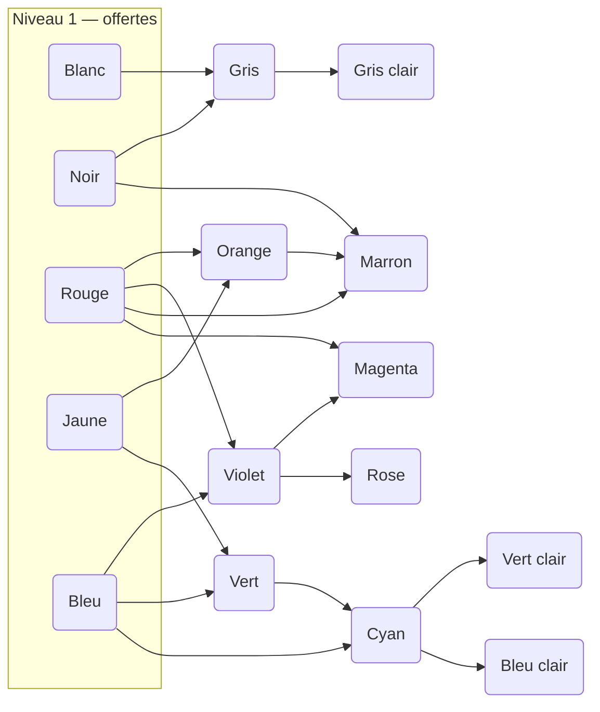

# VoxelPlace — Arbre de progression

> Source de vérité : `apps/socket-server/src/features/unlocks/tree.js`.
> Ce document la résume ; en cas d'écart, c'est le code qui fait foi.

Un compte neuf pose **5 couleurs**. Les 11 autres se débloquent en jouant : on remplit
des conditions (poser des pixels de certaines couleurs), puis on **dépense des heures de
streak**. Le verrouillage est appliqué **par le serveur** : `placePixel` refuse une couleur
non débloquée, quel que soit le client.

---

## Règles

### Streak (la monnaie)
- +1 h par heure où le joueur pose au moins un pixel.
- Remis à 0 après 24 h sans pixel.
- Débloquer un nœud dépense son coût ; le reste du solde est conservé.
- Le streak réduit aussi le cooldown (paliers `STREAK_COOLDOWNS` dans `@voxelplace/types`).

### Qui est concerné
| Joueur | Couleurs posables |
|--------|-------------------|
| Visiteur | Aucune (lecture seule) ; la palette lui montre celle d'un compte neuf |
| Compte `user` | Couleurs de base + couleurs débloquées |
| `superuser`, `admin`, `superadmin` | Les 16, **calculées** à la pose : rien n'est écrit en base, un rôle retiré rend la progression réelle |
| Joueur Minecraft | Les 16 (blocs de béton) — voir ci-dessous |

**Asymétrie Minecraft.** Un joueur Minecraft n'a pas de compte VoxelPlace, donc pas de
progression : le pont authentifié (`BRIDGE_TOKEN`) n'est pas soumis au verrouillage, et le
plugin distribue les 16 blocs. Lier un compte Minecraft à un compte web serait nécessaire
pour appliquer les mêmes règles.

### Comptes antérieurs au verrouillage
Avant ce verrouillage, tout le monde posait les 16 couleurs. La migration
`2026-09-grant-played-colors` (exécutée une seule fois, tracée dans `schema_migrations`)
a accordé à chaque compte les couleurs de base et **toutes les couleurs qu'il avait déjà
posées au moins une fois**, d'après `pixel_history` (pixels des ponts de jeu et pseudos
effacés exclus).

---

## Couleurs

```mermaid
flowchart LR
  subgraph N1[Niveau 1 — offertes]
    C0(Blanc) & C3(Noir) & C5(Rouge) & C7(Jaune) & C12(Bleu)
  end
  C5 & C7 --> C6(Orange)
  C12 & C5 --> C13(Violet)
  C12 & C7 --> C9(Vert)
  C0 & C3 --> C2(Gris)
  C9 & C12 --> C10(Cyan)
  C5 & C6 & C3 --> C4(Marron)
  C5 & C13 --> C14(Magenta)
  C13 --> C15(Rose)
  C10 --> C8(Vert clair)
  C10 --> C11(Bleu clair)
  C2 --> C1(Gris clair)
```

| Niveau | Couleur | Conditions (pixels posés, cumulés) | Prérequis | Coût |
|--------|---------|-----------------------------------|-----------|------|
| 1 | Blanc, Noir, Rouge, Jaune, Bleu | — | — | offertes |
| 2 | Orange | 10 rouge + 10 jaune | — | 2 h |
| 2 | Violet | 10 bleu + 10 rouge | — | 2 h |
| 2 | Vert | 10 bleu + 10 jaune | — | 2 h |
| 3 | Gris | 10 blanc + 10 noir | — | 3 h |
| 3 | Cyan | 10 vert + 10 bleu | — | 3 h |
| 3 | Marron | 10 rouge + 10 orange + 10 noir | — | 3 h |
| 3 | Magenta | 10 rouge + 10 violet | — | 3 h |
| 4 | Rose | 10 blanc + 10 rouge + 10 violet | Violet | 5 h |
| 4 | Vert clair | 10 blanc + 10 jaune + 10 vert + 10 bleu | Cyan | 5 h |
| 4 | Bleu clair | 10 blanc + 10 bleu + 10 cyan | Cyan | 5 h |
| 4 | Gris clair | 10 blanc + 10 gris + 10 noir | Gris | 5 h |

---

## Fonctionnalités

Toutes sont pour l'instant **« À venir »** (`comingSoon`) : aucune interface ne les rend
utilisables. Elles restent visibles avec leurs conditions, mais ne se débloquent pas, ne
sont pas annoncées et ne coûtent rien. Chaque fonctionnalité livrée lève son marqueur.

| Fonctionnalité | Conditions | Coût |
|----------------|-----------|------|
| Sélection de zone | 1 pixel de chaque couleur débloquée | — |
| Partage de zone | Sélection de zone | 5 h |
| GIF de zone | Partage de zone | 10 h |
| Timelapse + GIF personnel | Sélection de zone, 3 jours joués, 1 pixel perdu | — |
| Timelapse + GIF canvas global | Timelapse personnel, 10 zones 64×64 visitées | — |
| Heatmap | 50 pixels perdus | — |
| Recherche joueur | 25 pixels écrasés | — |
| Dashboard global | 100 pixels écrasés | — |
| Dashboard joueur | 100 pixels posés | — |
| Profil public | Top 100 + toutes les autres fonctionnalités | — |
| Surbrillance de ses pixels | 1 pixel de chaque couleur de base | — |
| Mode clair/sombre | 10 blanc + 10 noir | — |

### Retirées de l'arbre
Le **classement**, les **statistiques personnelles**, la **minimap** et l'**inspecteur de
pixel** (« pixel blame ») figuraient dans l'arbre sans jamais avoir été verrouillés : ils
restent libres pour tous. Les nœuds du **chat** (en sommeil, non exposé) sont retirés aussi.
Les lignes `user_unlocks` correspondantes, déjà acquises, sont conservées et ignorées.
