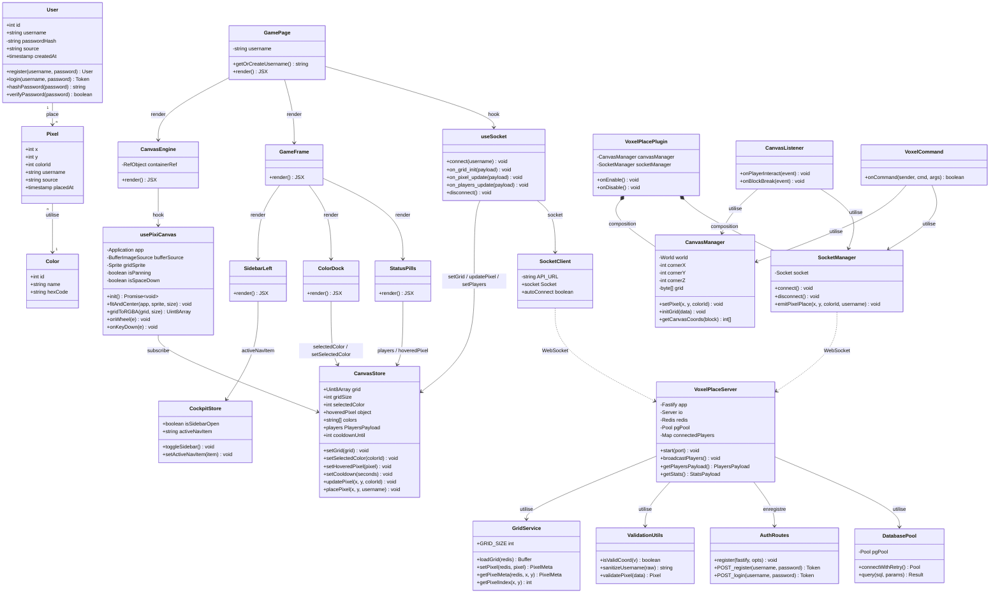

# Diagramme de Classes — VoxelPlace

---

## Notes sur l'architecture

### Zustand vs React state
Les stores **CanvasStore** et **CockpitStore** sont des singletons Zustand avec `subscribeWithSelector`. Le moteur PixiJS (`usePixiCanvas`) s'abonne directement à `CanvasStore` **sans passer par React** : il n'y a aucun re-render React lors d'un `pixel:update` entrant — seule la texture GPU est mise à jour.

### Séparation des responsabilités (features)

| Feature | Responsabilité |
|---------|----------------|
| `canvas/` | Moteur PixiJS, store grille, zoom/pan, placement pixel |
| `hud/` | Chrome UI (GameFrame, ColorDock, StatusPills, SidebarLeft), store UI |
| `realtime/` | Socket.io client singleton + hook de connexion |
| `stats/` | Dashboard analytics (Phase 5) |
| `admin/` | Modération (Phase 5) |
| `platforms/` | UI spécifique par plateforme (Phase 6) |
