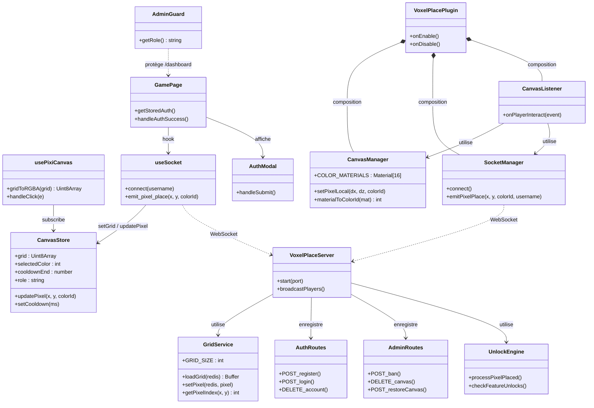

# Diagramme de Classes — VoxelPlace

---

## Architecture en couches

| Couche | Technologie | Rôle |
|--------|-------------|------|
| **Frontend** | Next.js 16 + Pixi.js + Zustand | Canvas GPU, HUD, auth |
| **Backend** | Fastify 5 + Socket.io 4 | API REST + WebSocket |
| **Stockage** | Redis + PostgreSQL | Grille temps réel + historique |
| **Minecraft** | Paper 1.21.1 + socket.io-client | Pont jeu ↔ canvas |
