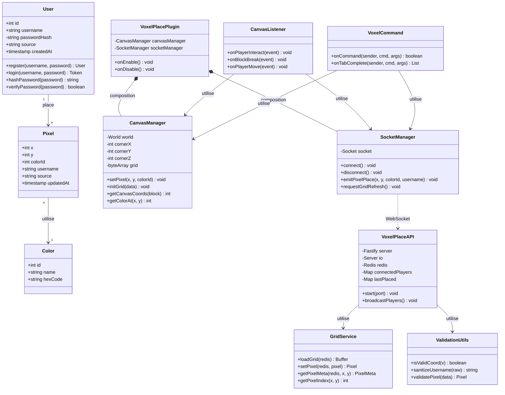

# Diagramme de Classes — VoxelPlace

```mermaid
classDiagram

    %% Entités métier

    class User {
        +int id
        +string username
        -string passwordHash
        +string source
        +timestamp createdAt
        +register(username, password) User
        +login(username, password) Token
        +hashPassword(password) string
        +verifyPassword(password) boolean
    }

    class Pixel {
        +int x
        +int y
        +int colorId
        +string username
        +string source
        +timestamp updatedAt
    }

    class Color {
        +int id
        +string name
        +string hexCode
    }

    %% Backend

    class VoxelPlaceAPI {
        -Fastify server
        -Server io
        -Redis redis
        -Map connectedPlayers
        -Map lastPlaced
        +start(port) void
        +broadcastPlayers() void
    }

    class GridService {
        +loadGrid(redis) Buffer
        +setPixel(redis, pixel) Pixel
        +getPixelMeta(redis, x, y) PixelMeta
        +getPixelIndex(x, y) int
    }

    class ValidationUtils {
        +isValidCoord(v) boolean
        +sanitizeUsername(raw) string
        +validatePixel(data) Pixel
    }

    %% Minecraft Plugin

    class VoxelPlacePlugin {
        -CanvasManager canvasManager
        -SocketManager socketManager
        +onEnable() void
        +onDisable() void
    }

    class CanvasManager {
        -World world
        -int cornerX
        -int cornerY
        -int cornerZ
        -byteArray grid
        +setPixel(x, y, colorId) void
        +initGrid(data) void
        +getCanvasCoords(block) int
        +getColorAt(x, y) int
    }

    class SocketManager {
        -Socket socket
        +connect() void
        +disconnect() void
        +emitPixelPlace(x, y, colorId, username) void
        +requestGridRefresh() void
    }

    class CanvasListener {
        +onPlayerInteract(event) void
        +onBlockBreak(event) void
        +onPlayerMove(event) void
    }

    class VoxelCommand {
        +onCommand(sender, cmd, args) boolean
        +onTabComplete(sender, cmd, args) List
    }

    %% Relations

    User "1" --> "n" Pixel : place
    Pixel "n" --> "1" Color : utilise

    VoxelPlaceAPI --> GridService : utilise
    VoxelPlaceAPI --> ValidationUtils : utilise

    VoxelPlacePlugin *-- CanvasManager : composition
    VoxelPlacePlugin *-- SocketManager : composition
    CanvasListener --> CanvasManager : utilise
    CanvasListener --> SocketManager : utilise
    VoxelCommand --> CanvasManager : utilise
    VoxelCommand --> SocketManager : utilise

    SocketManager ..> VoxelPlaceAPI : WebSocket
```
