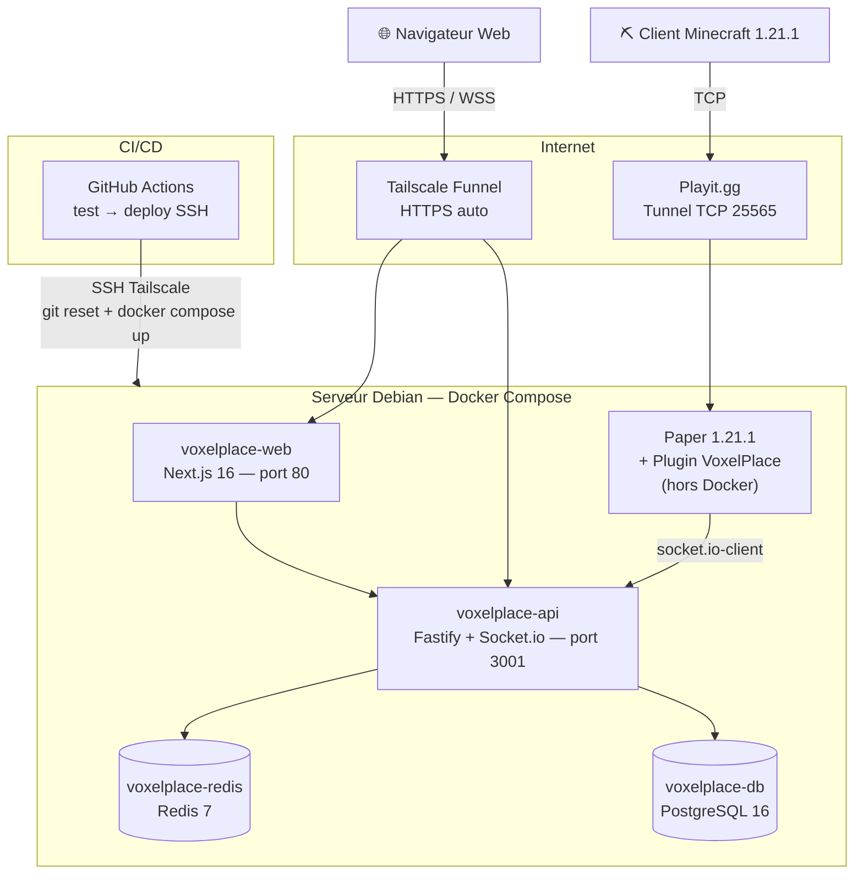

# Diagramme de Déploiement — VoxelPlace

---

| Composant | Image | Port |
|-----------|-------|------|
| `voxelplace-web` | node:20-alpine (Next.js standalone) | 80 |
| `voxelplace-api` | node:20-alpine | 3001 |
| `voxelplace-db` | postgres:16-alpine | 5432 (interne) |
| `voxelplace-redis` | redis:7-alpine (RDB + AOF) | 6379 (interne) |
| Paper 1.21.1 | JVM — hors Docker | 25565 via Playit.gg |
