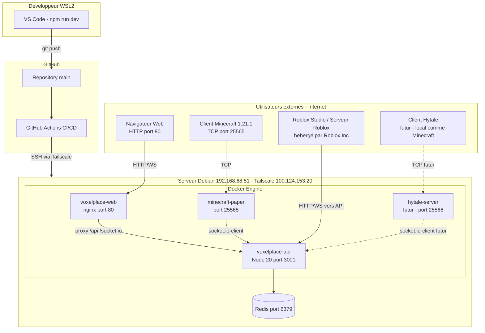

# Diagramme de Déploiement — VoxelPlace

```mermaid
graph TB
    subgraph EXT["Utilisateurs externes - Internet"]
        Browser["Navigateur Web\nHTTP port 80"]
        MCClient["Client Minecraft 1.21.1\nTCP port 25565"]
        RBStudio["Roblox Studio / Serveur Roblox\nhebergé par Roblox Inc"]
        HYClient["Client Hytale\nfutur - local comme Minecraft"]
    end

    subgraph GH["GitHub"]
        Repo["Repository main"]
        Actions["GitHub Actions CI/CD"]
    end

    subgraph Server["Serveur Debian 192.168.68.51 - Tailscale 100.124.153.20"]
        subgraph Docker["Docker Engine"]
            ContainerFront["voxelplace-web\nnginx port 80"]
            ContainerAPI["voxelplace-api\nNode 20 port 3001"]
            ContainerMC["minecraft-paper\nport 25565"]
            ContainerHY["hytale-server\nfutur - port 25566"]
        end
        Redis[("Redis port 6379")]
    end

    subgraph Dev["Developpeur WSL2"]
        LocalDev["VS Code - npm run dev"]
    end

    Browser -->|"HTTP/WS"| ContainerFront
    MCClient -->|"TCP"| ContainerMC
    RBStudio -->|"HTTP/WS vers API"| ContainerAPI
    HYClient -.->|"TCP futur"| ContainerHY

    ContainerFront -->|"proxy /api /socket.io"| ContainerAPI
    ContainerMC -->|"socket.io-client"| ContainerAPI
    ContainerHY -.->|"socket.io-client futur"| ContainerAPI
    ContainerAPI --> Redis

    LocalDev -->|"git push"| Repo
    Repo --> Actions
    Actions -->|"SSH via Tailscale"| Server
```
