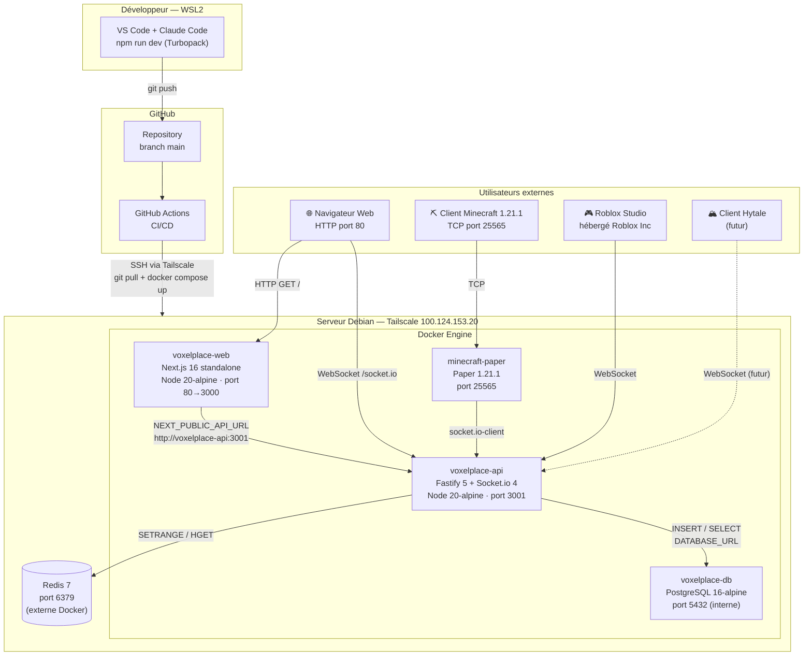

# Diagramme de Déploiement — VoxelPlace



---

## Description des conteneurs

| Conteneur | Image | Port exposé | Rôle |
|-----------|-------|-------------|------|
| `voxelplace-web` | `node:20-alpine` (Next.js standalone) | `80 → 3000` | Serveur SSR/CSR Next.js — sert les pages React + assets statiques |
| `voxelplace-api` | `node:20-alpine` | `3001` | Fastify 5 + Socket.io 4 — API REST + WebSocket temps réel |
| `voxelplace-db` | `postgres:16-alpine` | `5432` (interne) | PostgreSQL — tables `users` + `pixel_history` |
| `minecraft-paper` | Manuel | `25565` | Serveur Paper 1.21.1 avec plugin VoxelPlace |

> **Redis** tourne en dehors de Docker sur le même serveur (`192.168.68.51:6379`).

## Build Next.js — Multi-stage Dockerfile

```
Stage 1 : deps     → npm ci (workspace node_modules)
Stage 2 : builder  → npx turbo build --filter=@voxelplace/web → .next/standalone
Stage 3 : runner   → node:20-alpine, node apps/web/server.js
```

La sortie `output: 'standalone'` de Next.js produit un bundle autonome sans `node_modules` complet, ce qui réduit l'image finale à ~150 Mo.
