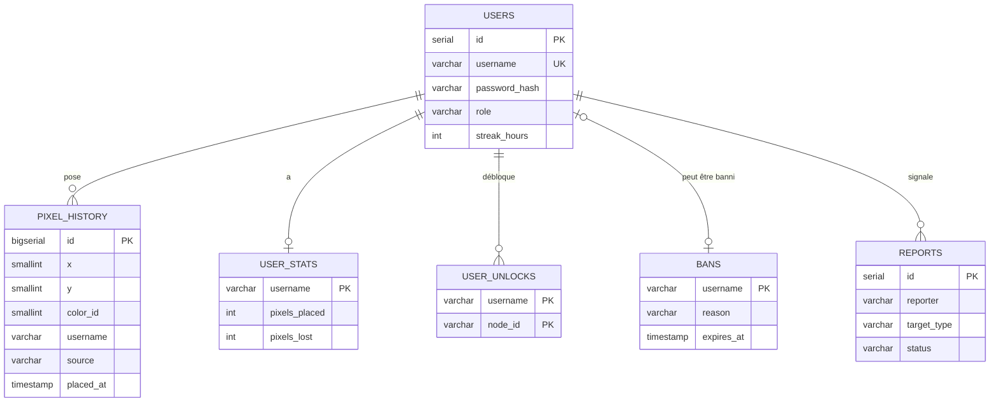

# ERD / Merise — VoxelPlace

> **Redis** stocke la grille courante (buffer binaire 4 Mo, lecture O(1)).
> **PostgreSQL** stocke tout ce qui nécessite de l'historique ou des requêtes SQL.

---

## MCD — Modèle Conceptuel de Données

```
USERS ──(1,n)── PLACE ──(1,1)── PIXEL_HISTORY
  │
  ├─(1,1)── A ──── USER_STATS
  ├─(1,n)── DÉBLOQUE ──── USER_UNLOCKS
  ├─(0,1)── EST_BANNI ──── BANS
  └─(0,n)── SOUMET ──── REPORTS
```

---

## MLD — Modèle Logique de Données

```
USERS         ( #id, username, password_hash, role, streak_hours, created_at )
PIXEL_HISTORY ( #id, x, y, color_id, username, source, placed_at )
USER_STATS    ( #username=>USERS, pixels_placed, pixels_lost, pixels_overwritten )
USER_UNLOCKS  ( #username=>USERS, #node_id, unlocked_at )
BANS          ( #username=>USERS, reason, banned_by, expires_at )
REPORTS       ( #id, reporter, target_type, x, y, reason, status )
SHARED_ZONES  ( #id, x, y, w, h, label, created_by=>USERS, expires_at )
PIXEL_MESSAGES( #id, x, y, username=>USERS, message, created_at )
MODERATION_LOGS( #id, action, target, admin=>USERS, created_at )
```

*# = clé primaire · => = référence*

---

## ERD (MermaidJS)



---

## Justification Redis vs PostgreSQL

| Critère | Redis | PostgreSQL |
|---------|-------|-----------|
| Lecture grille (2048×2048) | O(1) — 4 Mo buffer | O(n) — reconstruction |
| Écriture pixel | O(1) — SETRANGE | INSERT pixel_history |
| Requêtes analytiques | ❌ | ✅ heatmap, timelapse, stats |
| Auth / ACID | ❌ | ✅ bcrypt, transactions |
