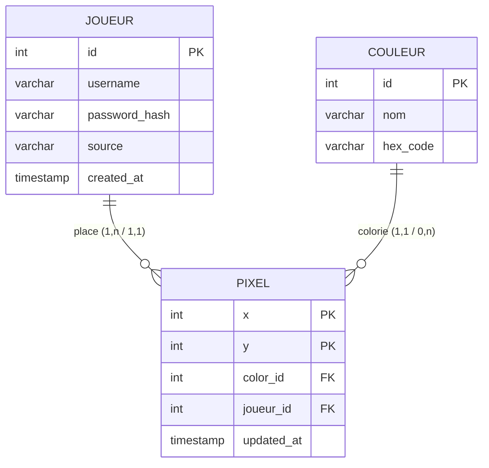

# ERD / Merise — VoxelPlace

> VoxelPlace utilise **Redis** (NoSQL) pour la performance temps réel.
> Ce document présente l'équivalent **SQL** (MCD → MLD → ERD Mermaid).

---

## MCD — Modèle Conceptuel de Données

```
┌─────────────────────┐          ┌─────────────┐          ┌────────────────────┐
│       JOUEUR        │          │    PLACE    │          │       PIXEL        │
│─────────────────────│  1,n     │─────────────│  1,1     │────────────────────│
│ <u>id</u>           │──────────│ updated_at  │──────────│ <u>x</u>           │
│ username            │          │             │          │ <u>y</u>           │
│ password_hash       │          └─────────────┘          │ color_id           │
│ source              │                                   └────────────────────┘
│ created_at          │                                            │
└─────────────────────┘                                      1,1   │ A_POUR_COULEUR
                                                             0,n   │
                                                    ┌─────────────────────┐
                                                    │      COULEUR        │
                                                    │─────────────────────│
                                                    │ <u>id</u>           │
                                                    │ nom                 │
                                                    │ hex_code            │
                                                    └─────────────────────┘
```

**Cardinalités :**
- Un `JOUEUR` **place** `1,n` PIXEL ↔ un PIXEL est placé par `1,1` JOUEUR
- Un `PIXEL` **a pour couleur** `1,1` COULEUR ↔ une COULEUR colorie `0,n` PIXEL

---

## MLD — Modèle Logique de Données

```
COULEUR ( #id, nom, hex_code )

JOUEUR  ( #id, username, password_hash, source, created_at )

PIXEL   ( #x, #y, color_id=>COULEUR.id, joueur_id=>JOUEUR.id, updated_at )
```

*Légende : # = clé primaire, => = clé étrangère*

---

## ERD — Entity Relationship Diagram (MermaidJS)



---

## Justification du choix Redis

| Critère | Redis (actuel) | PostgreSQL |
|---------|----------------|------------|
| Lecture grille | O(1) — buffer 4096 bytes | O(n) — SELECT |
| Temps réel | ✅ Natif | ❌ Polling |
| Schéma fixe | ✅ Non requis | ❌ Migrations |
| Requêtes SQL | ❌ Non supporté | ✅ Jointures, agrégats |
| Persistance | ✅ RDB/AOF | ✅ ACID complet |
| Auth utilisateurs | ❌ Pas adapté | ✅ Idéal |

**Évolution prévue :** PostgreSQL en complément pour les comptes utilisateurs
(table `JOUEUR` avec `password_hash` bcrypt), Redis conservant la grille temps réel.
