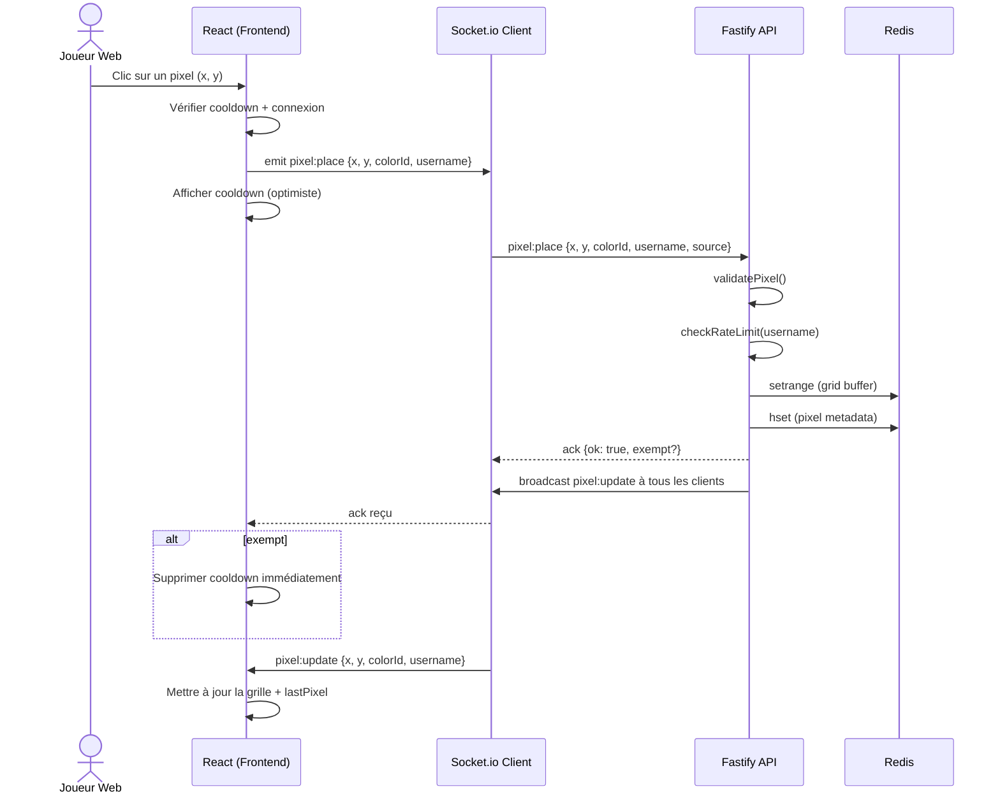
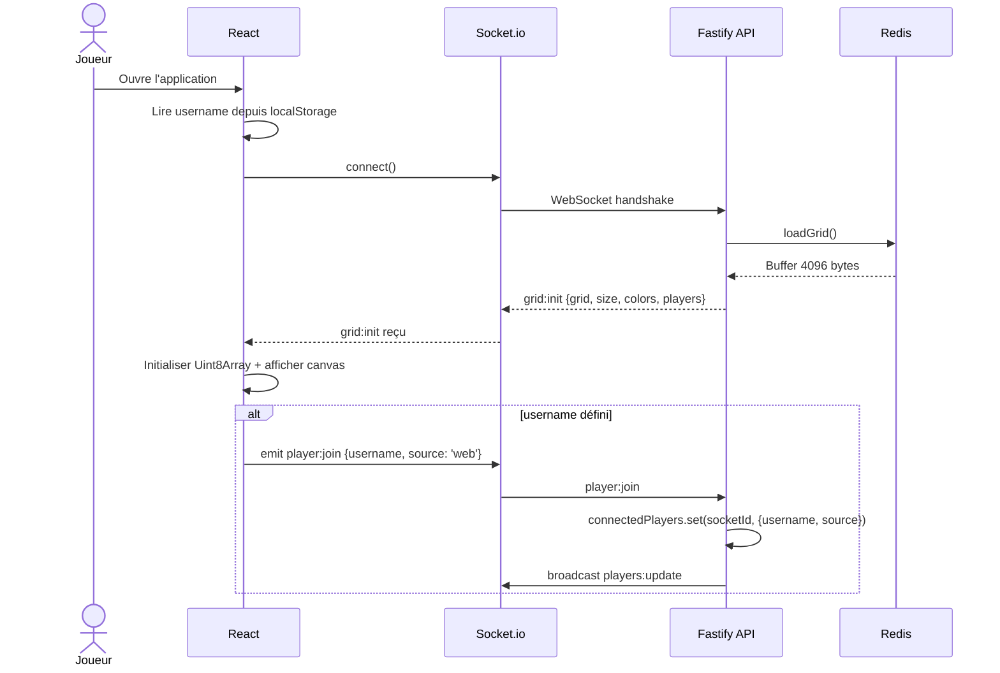
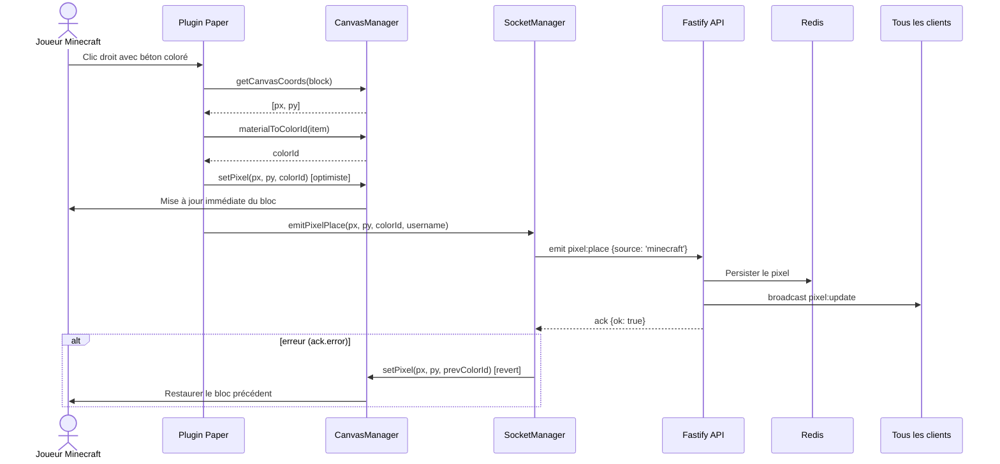

# Diagrammes de Séquence — VoxelPlace

## 1. Placement d'un pixel (Web)

```mermaid
sequenceDiagram
    actor User as Joueur Web
    participant Front as React (Frontend)
    participant Socket as Socket.io Client
    participant API as Fastify API
    participant Redis as Redis

    User->>Front: Clic sur un pixel (x, y)
    Front->>Front: Vérifier cooldown + connexion
    Front->>Socket: emit pixel:place {x, y, colorId, username}
    Front->>Front: Afficher cooldown (optimiste)

    Socket->>API: pixel:place {x, y, colorId, username, source}
    API->>API: validatePixel()
    API->>API: checkRateLimit(username)
    API->>Redis: setrange (grid buffer)
    API->>Redis: hset (pixel metadata)
    API-->>Socket: ack {ok: true, exempt?}
    API->>Socket: broadcast pixel:update à tous les clients

    Socket-->>Front: ack reçu
    alt exempt
        Front->>Front: Supprimer cooldown immédiatement
    end

    Socket->>Front: pixel:update {x, y, colorId, username}
    Front->>Front: Mettre à jour la grille + lastPixel
```

## 2. Connexion initiale

```mermaid
sequenceDiagram
    actor User as Joueur
    participant Front as React
    participant Socket as Socket.io
    participant API as Fastify API
    participant Redis as Redis

    User->>Front: Ouvre l'application
    Front->>Front: Lire username depuis localStorage
    Front->>Socket: connect()
    Socket->>API: WebSocket handshake
    API->>Redis: loadGrid()
    Redis-->>API: Buffer 4096 bytes
    API-->>Socket: grid:init {grid, size, colors, players}
    Socket-->>Front: grid:init reçu
    Front->>Front: Initialiser Uint8Array + afficher canvas

    alt username défini
        Front->>Socket: emit player:join {username, source: 'web'}
        Socket->>API: player:join
        API->>API: connectedPlayers.set(socketId, {username, source})
        API->>Socket: broadcast players:update
    end
```

## 3. Placement d'un bloc Minecraft

```mermaid
sequenceDiagram
    actor MC as Joueur Minecraft
    participant Plugin as Plugin Paper
    participant CM as CanvasManager
    participant SM as SocketManager
    participant API as Fastify API
    participant Redis as Redis
    participant Clients as Tous les clients

    MC->>Plugin: Clic droit avec béton coloré
    Plugin->>CM: getCanvasCoords(block)
    CM-->>Plugin: [px, py]
    Plugin->>CM: materialToColorId(item)
    CM-->>Plugin: colorId
    Plugin->>CM: setPixel(px, py, colorId) [optimiste]
    CM->>MC: Mise à jour immédiate du bloc

    Plugin->>SM: emitPixelPlace(px, py, colorId, username)
    SM->>API: emit pixel:place {source: 'minecraft'}
    API->>Redis: Persister le pixel
    API->>Clients: broadcast pixel:update
    API-->>SM: ack {ok: true}

    alt erreur (ack.error)
        SM->>CM: setPixel(px, py, prevColorId) [revert]
        CM->>MC: Restaurer le bloc précédent
    end
```
