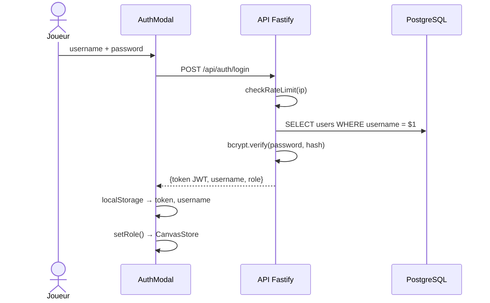
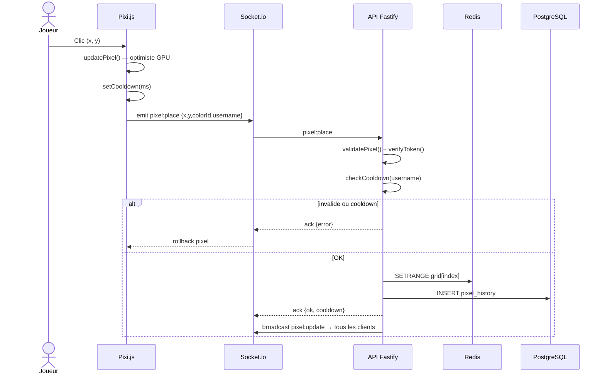
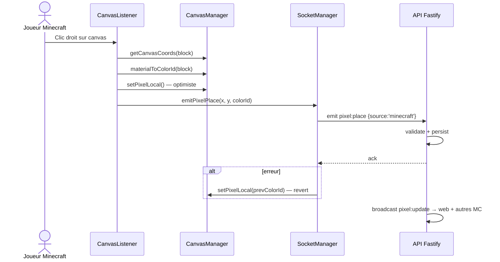

# Diagrammes de Séquence — VoxelPlace

## 1. Connexion et auth

```mermaid
sequenceDiagram
    actor U as Joueur
    participant M as AuthModal
    participant A as API Fastify
    participant D as PostgreSQL

    U->>M: username + password
    M->>A: POST /api/auth/login
    A->>A: checkRateLimit(ip)
    A->>D: SELECT users WHERE username = $1
    A->>A: bcrypt.verify(password, hash)
    A-->>M: {token JWT, username, role}
    M->>M: localStorage → token, username
    M->>M: setRole() → CanvasStore
```

---

## 2. Placement d'un pixel (Web)

```mermaid
sequenceDiagram
    actor U as Joueur
    participant P as Pixi.js
    participant S as Socket.io
    participant A as API Fastify
    participant R as Redis
    participant D as PostgreSQL

    U->>P: Clic (x, y)
    P->>P: updatePixel() — optimiste GPU
    P->>P: setCooldown(ms)
    P->>S: emit pixel:place {x,y,colorId,username}

    S->>A: pixel:place
    A->>A: validatePixel() + verifyToken()
    A->>A: checkCooldown(username)

    alt invalide ou cooldown
        A-->>S: ack {error}
        S-->>P: rollback pixel
    else OK
        A->>R: SETRANGE grid[index]
        A->>D: INSERT pixel_history
        A-->>S: ack {ok, cooldown}
        A->>S: broadcast pixel:update → tous les clients
    end
```

---

## 3. Placement d'un bloc Minecraft

```mermaid
sequenceDiagram
    actor MC as Joueur Minecraft
    participant L as CanvasListener
    participant CM as CanvasManager
    participant SM as SocketManager
    participant A as API Fastify

    MC->>L: Clic droit sur canvas
    L->>CM: getCanvasCoords(block)
    L->>CM: materialToColorId(block)
    L->>CM: setPixelLocal() — optimiste
    L->>SM: emitPixelPlace(x, y, colorId)
    SM->>A: emit pixel:place {source:'minecraft'}
    A->>A: validate + persist
    A-->>SM: ack

    alt erreur
        SM->>CM: setPixelLocal(prevColorId) — revert
    end
    A->>A: broadcast pixel:update → web + autres MC
```
