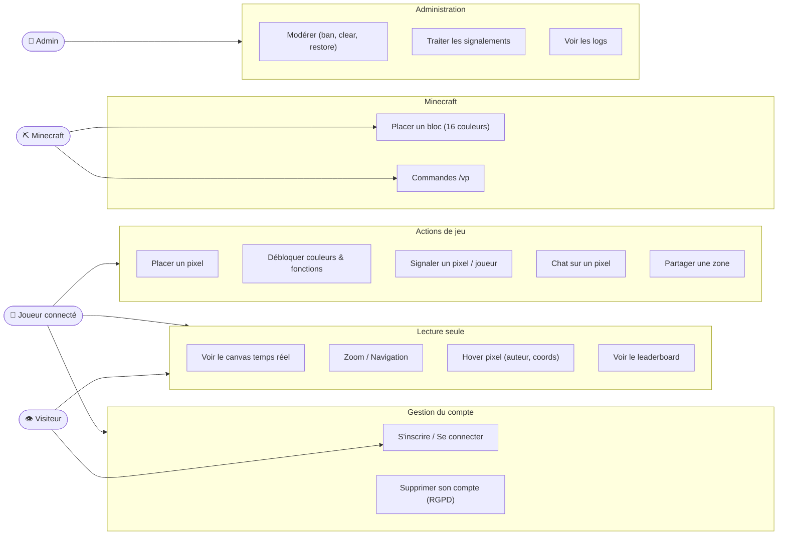

# Diagramme de Cas d'Utilisation — VoxelPlace

---

| Acteur | Cooldown pixel | Accès |
|--------|---------------|-------|
| Visiteur | — | Lecture seule |
| `user` | 60 s | Jeu complet |
| `superuser` (hbtn_*) | 1 s | Jeu complet |
| `admin` | 5 s | + modération |
| `superadmin` | 0 s | Accès total |
