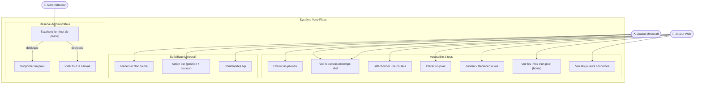

# Diagramme de Cas d'Utilisation — VoxelPlace

```mermaid
flowchart TB
    JW(["👤 Joueur Web"])
    JM(["⛏ Joueur Minecraft"])
    AD(["👑 Administrateur"])

    subgraph SYS["Système VoxelPlace"]
        direction TB

        subgraph PUBLIC["Accessible à tous"]
            UC1["Choisir un pseudo"]
            UC2["Voir le canvas en temps réel"]
            UC3["Sélectionner une couleur"]
            UC4["Placer un pixel"]
            UC5["Zoomer / Déplacer la vue"]
            UC6["Voir les infos d'un pixel (hover)"]
            UC7["Voir les joueurs connectés"]
        end

        subgraph MINECRAFT["Spécifique Minecraft"]
            UC8["Placer un bloc coloré"]
            UC9["Action bar (position + couleur)"]
            UC10["Commandes /vp"]
        end

        subgraph ADMIN["Réservé Administrateur"]
            UC11["S'authentifier (mot de passe)"]
            UC12["Supprimer un pixel"]
            UC13["Vider tout le canvas"]
        end
    end

    JW --> UC1
    JW --> UC2
    JW --> UC3
    JW --> UC4
    JW --> UC5
    JW --> UC6
    JW --> UC7

    JM --> UC2
    JM --> UC8
    JM --> UC9
    JM --> UC10

    AD --> UC11
    UC11 -->|"débloque"| UC12
    UC11 -->|"débloque"| UC13
```
